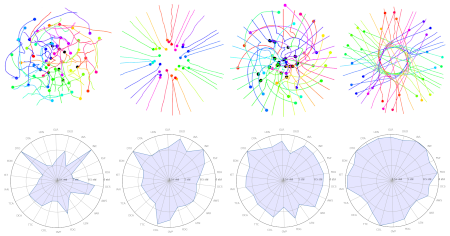
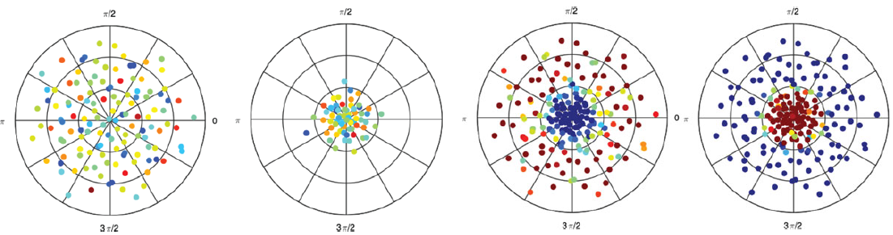
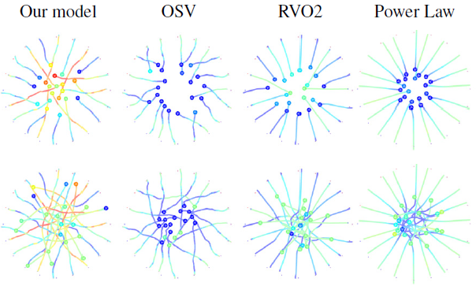
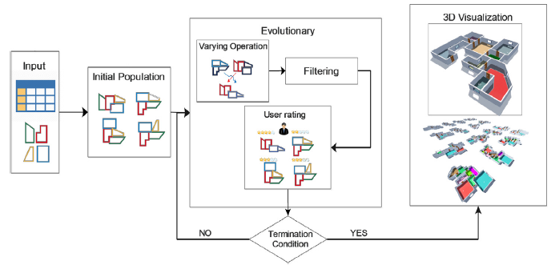
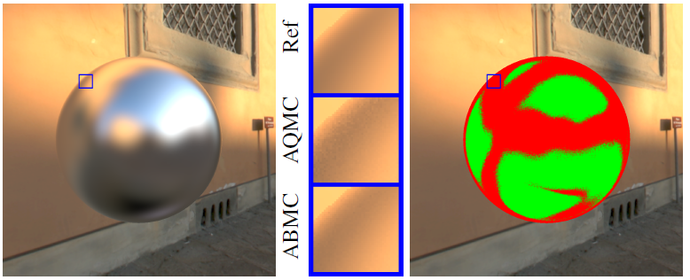
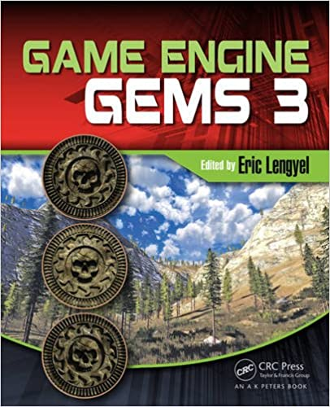
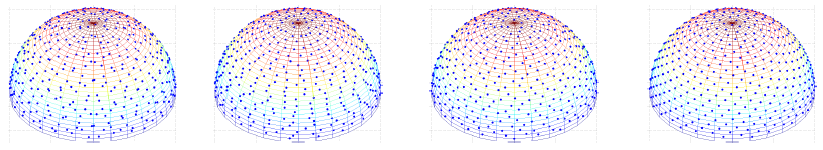

# Short Bio

I received my BSc degree in Informatics (2007) and MSc degree in Informatics (2009) from University of Minho, Portugal, after which I worked as a researcher in real-time global illumination in the same university. I joined INRIA (Institut National de Recherche en Informatique et Automatique, France) and the FRVSense team as a PhD student in the fall 2010 under the supervision of Professor Kadi Bouatouch. In my PhD thesis, I focused on spherical integration methods applied to light transport simulation. I defended my PhD thesis in the fall 2013 and joined the Mimetic INRIA research team as a research engineer in 2014, where I worked in the field of Crowd Simulation. From fall 2016 to summer 2020 I worked in the Interactive Technologies Group (GTI) of Universitat Pompeu Fabra (Barcelona), first supported by a Marie Sklodowska-Curie individual fellowship on the topic of Bayesian Monte Carlo Rendering, and then as Professor Lector. In June 2020 I joined the Universitat de Barcelona as Professor Lector Serra Húnter (tenure track), where I also had the chance to extend my research activities to deep learning methods.

# Publications 

**(2022)** A. Colom, <ins>*R. Marques*</ins>, L. P. Santos, "[Interactive VPL-based Global Illumination on the GPU using Fuzzy Clustering](https://xxx)", 
Computers & Graphics (to appear)
* To be presented at the *International Conference on Graphics and Interaction* ([ICGI’2022](https://gpcg.pt/icgi2022/)), Aveiro, Portugal 

**(2022)** <ins>*R. Marques*</ins>, C. Bouville, K. Bouatouch, "[Gaussian Process for Radiance Functions on the S2 Sphere](https://onlinelibrary.wiley.com/doi/10.1111/cgf.14501)", Computer Graphics Forum (to appear)

* Presented at the *33rd Eurographics Symposium on Rendering* ([EGSR 2022](https://egsr.eu/2022/)), Prague, Czech Republic 

**(2022)** B. Cabrero-Daniel, <ins>*R. Marques*</ins>, L. Hoyet, J. Pettré, J. Blat, "[Dynamic Combination of Crowd Steering Policies Based on Context](https://onlinelibrary.wiley.com/doi/abs/10.1111/cgf.14469)", Computer Graphics Forum (Volume: 41, Issue: 2)

* Presented at the *43rd Annual Conference of the European Association for Computer Graphics* ([EUROGRAPHICS 2022](https://eg2022.univ-reims.fr/)), Reims, France

**(2022)** B. Nagarajan, <ins>*R. Marques*</ins>, M. Mejia, P. Radeva, "[Class-conditional Importance Weighting for Deep Learning with Noisy Labels](https://www.scitepress.org/PublicationsDetail.aspx?ID=TOdJng5g9OY=&t=1)", Proceedings of the 17th International Joint Conference on Computer Vision, Imaging and Computer Graphics Theory and Applications - Volume 5: VISAPP, ISBN 978-989-758-555-5, pages 679-686

* Presented at the *17th International Joint Conference on Computer Vision, Imaging and Computer Graphics Theory and Applications* ([VISIGRAPP 2022](https://visigrapp.scitevents.org/)), Online Event

**(2021)** B. Cabrero-Daniel, <ins>*R. Marques*</ins>, L. Hoyet, J. Pettré, J. Blat, "[A Perceptually-Validated Metric for Crowd Trajectory Quality Evaluation](https://dl.acm.org/doi/10.1145/3480136)", Proceedings of the ACM on Computer Graphics and Interactive Techniques (Volume 4, Issue 3)

* Presented at the *20th Symposium on Computer Animation* ([SCA 2021](https://computeranimation.org/2021/)), Online Event

<!--  -->

**(2021)** <ins>*R. Marques*</ins>, C. Bouville, K. Bouatouch, "[Extensible Spherical Fibonacci Grids](https://doi.org/10.1109/tvcg.2019.2952131)", IEEE Transactions on Visualization and Computer Graphics (Volume: 27, Issue: 4)

* Presented at the *28th and 29th Pacific Conference on Computer Graphics and Applications* ([PG20+21](https://www.pg2021.org/)), Wellington, New Zealand (online event)
* Presented at the *XXXI Congreso Español de Informática Gráfica* ([CEIG 2022](https://mon.uvic.cat/ceig2022/)), Vic, Spain

<!--  -->

**(2020)** <ins>*R. Marques*</ins>, C. Bouville, K. Bouatouch, "[Spectral Analysis of Quadrature Rules and Fourier Truncation-Based Methods Applied to Shading Integrals](https://doi.org/10.1109/tvcg.2019.2913418)", IEEE Transactions on Visualization and Computer Graphics (Volume: 26, Issue: 10)

* Presented at the *27th Pacific Conference on Computer Graphics and Applications* ([PG2019](http://pg19.org/)), Seoul, South Korea

<!--  -->

**(2019)** <ins>*R. Marques*</ins>, C. Bouville, K. Bouatouch, "[Optimal Sample Weights for Hemispherical Integral Quadratures](https://doi.org/10.1111/cgf.13392)", Computer Graphics Forum (Volume: 38, Issue: 1)

* Presented at the *29th Eurographics Symposium on Rendering* ([EGSR 2018](https://cg.ivd.kit.edu/egsr18/)), Karlsruhe, Germany
* Presented at the *XXX Congreso Español de Informática Gráfica* ([CEIG 2021](https://www.virvig.eu/ceig2021/)), Málaga, Spain

<!--  -->

**(2017)** T. Dutra, <ins>*R. Marques*</ins> (joint first author), J. Cavalcante-Neto, C. Vidal, J. Pettré, "[Gradient‐based Steering for Vision‐based Crowd Simulation Algorithms](https://doi.org/10.1111/cgf.13130)", Computer Graphics Forum (Volume: 36, Issue: 2)

* Presented at the *38th Annual Conference of the European Association for Computer Graphics* (EUROGRAPHICS 2017), Lyon, France
* Presented at the *XXVII Congreso Español de Informática Gráfica* (CEIG 2017), Sevilla, Spain

<!--  -->

**(2017)** A. Bahrehmand, T. Batard, <ins>*R. Marques*</ins>, A. Evans, J. Blat, "[Optimizing layout using spatial quality metrics and user preferences](https://doi.org/10.1016/j.gmod.2017.08.003)", Graphical Models (Volume: 93)

<!--  -->

**(2016)** <ins>*R. Marques*</ins>, C. Bouville, L. P. Santos, K. Bouatouch, "[Two-Level Adaptive Sampling for Illumination Integrals using Bayesian Monte Carlo](https://diglib.eg.org/bitstream/handle/10.2312/egsh20161016/065-068.pdf?sequence=1&isAllowed=y)", 37th Annual Conference of the European Association for Computer Graphics, Eurographics 2016 - Short Papers, Lisbon, Portugal

<!--  -->

**(2016)** T. Bezerra Dutra, <ins>*R. Marques*</ins>, Julien Pettré, "[Vision Based Local Collision Avoidance](http://www.gameenginegems.net/geg3.php)", Game Engine Gems 3, 239–253 (book chapter)

<!--  -->

**(2015)** <ins>*R. Marques*</ins>, C. Bouville, L. P. Santos, K. Bouatouch, "[Efficient quadrature rules for illumination integrals: From quasi Monte Carlo to Bayesian Monte Carlo](https://www.morganclaypool.com/doi/abs/10.2200/S00649ED1V01Y201505CGR019)", Synthesis Lectures on Computer Graphics and Animation 7 (2), 1-92 (full book)

**(2013)** <ins>*R. Marques*</ins>, C. Bouville, M. Ribardière, L. P. Santos, K. Bouatouch, "[A Spherical Gaussian Framework for Bayesian Monte Carlo Rendering of Glossy Surfaces](https://doi.org/10.1109/tvcg.2013.79)", IEEE Transactions on Visualization and Computer Graphics (Volume: 19, Issue: 10)

**(2013)** <ins>*R. Marques*</ins>, C. Bouville, M. Ribardière, L. P. Santos, K. Bouatouch, "[Spherical Fibonacci Point Sets for Illumination Integrals](https://doi.org/10.1111/cgf.12190)", Computer Graphics Forum (Volume: 32, Issue: 8)

<!--  -->

**(2010)** <ins>*R. Marques*</ins>, L. P. Santos, "[Instant Global Illumination on the GPU using Optix](https://repositorium.sdum.uminho.pt/bitstream/1822/14629/1/inforum2010_InstantCaching_GPU.pdf)", Proceedings of the 2nd INforum - Simpósio de Informática, Braga, Portugal

**(2009)** A. Pina, B. Oliveira, J. Puga, <ins>*R. Marques*</ins>, A. Proença, "[An OGC-WS Framework to run FireStation on the Grid](https://www.academia.edu/download/42072514/An_OGC-WS_Framework_to_Run_FireStation_o20160204-22236-1txw918.pdf)", Proceedings of the 3rd Iberian Grid Infrastructure Conference, Valencia, Spain

**(2009)** A. Pina, <ins>*R. Marques*</ins>, B. Oliveira, "[G-Fire Station: Fire Simulation from Desktop to Grid](https://repositorium.sdum.uminho.pt/handle/1822/19230)", 4th EGEE User Forum/OGF 25 and OGF Europe's 2nd International Event, Catania, Italy (abstract)

**(2009)** <ins>*R. Marques*</ins>, L. P. Santos, P. Leskovsky, C. Paloc, "[GPU Ray Casting](https://repositorium.sdum.uminho.pt/bitstream/1822/17833/1/RicardoEPCC_Final_MAC.pdf)", Proceedings of the 17th Encontro Português de Computação Gráfica, Covilhã, Portugal

**(2008)** A. Pina, <ins>*R. Marques*</ins>, B. Oliveira, "[FireStation: From Sequential to EGEE-Grid](https://www.academia.edu/download/42072500/FiresStation_From_Sequential_to_EGEE-Gri20160204-22322-fhamej.pdf)", Proceedings of the First EELA-2 Conference, Bogota, Colombia

### Other Sites

[Google Scholar](https://scholar.google.com/citations?user=hkriDdcAAAAJ&hl=es)

[ORCID](https://orcid.org/0000-0001-8261-4409)

[ResearcherID](https://publons.com/researcher/1441734/ricardo-marques/)

[Scopus Author](https://www.scopus.com/authid/detail.uri?authorId=57026328500")
